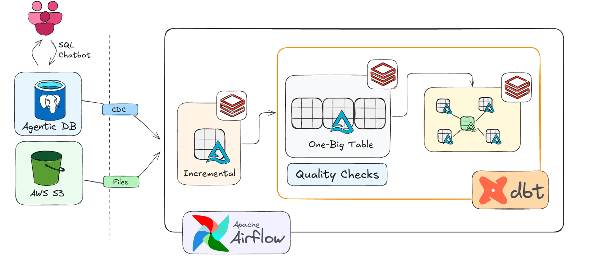
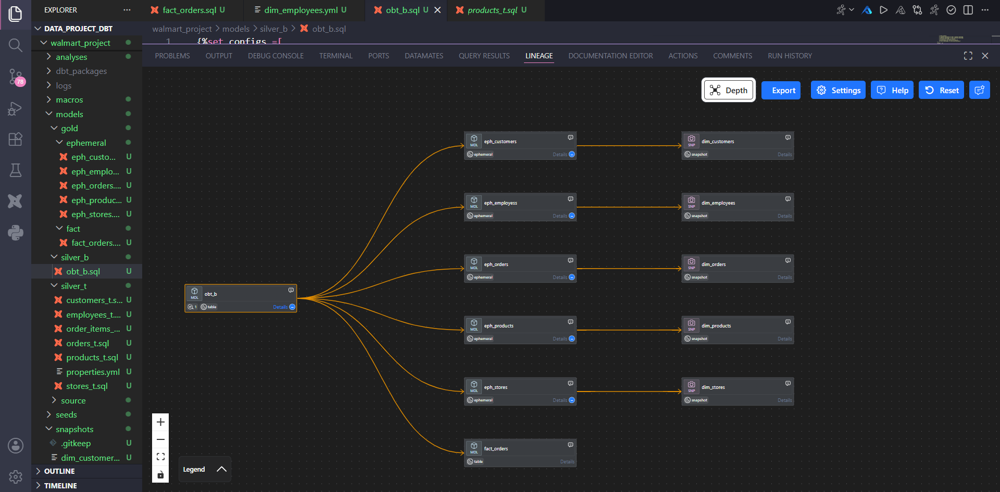
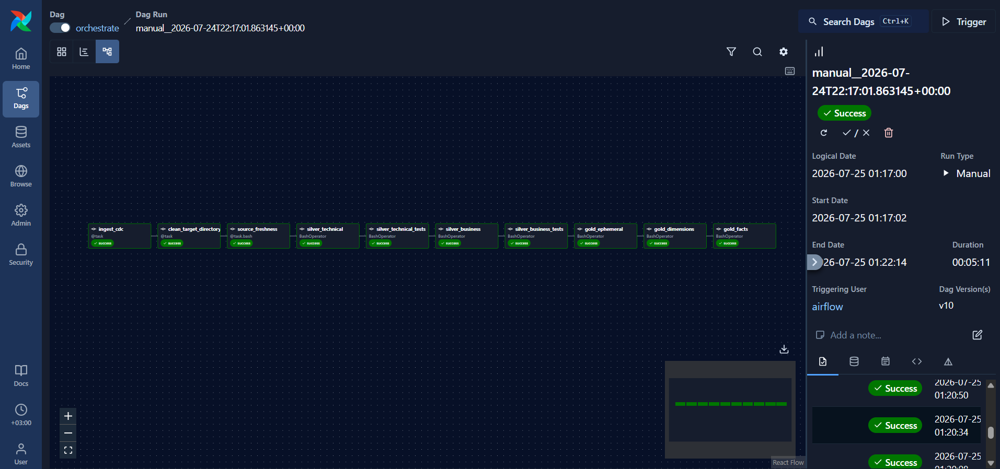

# 🚀 Databricks, dbt & Apache Airflow Data Lakehouse Platform

A modern, enterprise-grade Data Engineering & Analytics Platform demonstrating end-to-end orchestration, automated transformations, and dimensional modeling using **Apache Airflow**, **dbt Core (`dbt-databricks`)**, and **Databricks (Delta Lake Engine)**.

---

<p align="center">
  
</p>

---

## 🏗️ Architecture & Medallion Design

This project implements a multi-tier **Medallion Architecture** on Databricks Delta Lake, managed via dbt models and orchestrated seamlessly by Apache Airflow.

<p align="center">
  
</p>

### 🥉 1. Bronze Layer (Raw Ingestion)
* Ingests raw data streams/batches directly into Delta Lake format.
* Schema enforcement with minimal processing to preserve historical raw payload integrity.

### 🥈 2. Silver Layer (Cleaned & Conformed)
* Applies data filtering, deduplication, type casting, and schema validation.
* Consolidates intermediate source tables into clean, normalized models (`silver_t`) and One Big Table aggregates (`silver_b`).

### 🥇 3. Gold Layer (Business Analytics)
* Dimensional modeling (**Star Schema**) featuring optimized Fact and Dimension tables derived from Silver layers.
* Business aggregation models optimized for high-performance BI reporting and analytics queries.

---

## ⚡ Airflow DAG & Workflow Orchestration

The platform's end-to-end pipeline is orchestrated using Apache Airflow to guarantee data quality checks, dependency management, and automated execution across all transformation stages.

* **DAG ID:** `orchestrate`
* **Orchestration Workflow:** Ingestion CDC ➔ Environment Cleanup ➔ Freshness Checks ➔ Technical & Business Transformations ➔ Data Quality Tests ➔ Gold Dimensional Modeling.

<p align="center">
  
</p>

### Pipeline Execution Stages:
1. **`ingest_cdc`**: Ingests changed data capture payloads into the landing area.
2. **`clean_target_directory`**: Prepares working directories for intermediate transformations.
3. **`source_freshness`**: Verifies data pipeline SLA and upstream source freshness.
4. **`silver_technical` & `silver_technical_tests`**: Cleanses data and executes staging assertions.
5. **`silver_business` & `silver_business_tests`**: Transforms technical models into standardized business representations.
6. **`gold_ephemeral` / `gold_dimensions` / `gold_facts`**: Builds ultimate dimensional models (Star Schema) ready for BI analytics.

---

## 📖 Project Overview & Key Features

This platform showcases end-to-end data engineering best practices:

* **Orchestration**: Automated Apache Airflow DAG workflows with explicit dependencies, retries, and job tracking.
* **Transformations**: Modular dbt modeling using `dbt-databricks` with Delta Lake optimizations (such as `MERGE` and incremental models).
* **Data Quality Assertions**: Automated testing via dbt tests to prevent bad data propagation across layers.
* **Modern Stack Integration**: Unity Catalog compatible structure, containerized workflow setups, and decoupled compute/storage design.

---

## 🛠️ Tech Stack & Prerequisites

| Technology | Role / Function |
| :--- | :--- |
| **Databricks** | Compute Engine & Delta Lake Warehouse |
| **dbt Core (`dbt-databricks`)** | SQL Transformations & Modeling |
| **Apache Airflow** | Workflow Orchestration & DAG Management |
| **Docker** | Containerized Local Execution Environment |
| **Python 3.10+ / SQL** | Pipeline Logic & Scripting |

---

## 📂 Repository Structure

```text
Databricks_dbt_Airflow_Project/
│
├── dbt_project/                          # dbt models, macros, and configuration
│   ├── models/                           # Medallion layer transformation models
│   │   ├── bronze/                       # Raw source configurations & staging views
│   │   ├── silver_t/                     # Technical cleansing & normalization models
│   │   ├── silver_b/                     # One Big Table (OBT) business aggregation model
│   │   └── gold/                         # Star Schema Dimensional Modeling
│   │       ├── ephemeral/                # Temporary CTE models for intermediate metrics/logic
│   │       ├── dim/                      # Dimension tables (SCD Type 2 / master entities)
│   │       └── fact/                     # Fact tables (transactional & aggregated metrics)
│   │
│   ├── macros/                           # Reusable Jinja/SQL transformation functions
│   ├── snapshots/                        # dbt Snapshots for CDC & SCD Type 2 tracking
│   ├── tests/                            # Data quality assertions & schema tests
│   ├── dbt_project.yml                   # Main dbt project configuration settings
│   └── profiles.yml                      # Connection profiles for Databricks Delta Lake
│
├── dags/                                 # Apache Airflow DAG workflows
│   ├── orchestrate.py                    # Main pipeline execution DAG (`orchestrate`)
│   └── utils/                            # Custom operators and orchestration helper logic
│
├── docs/                                 # Visual architecture & workflow diagrams
│   ├── data_architecture.png             # Overall Medallion architecture diagram
│   ├── data_flow_diagram.png             # End-to-end data flow execution diagram
│   └── Dag.png                           # Airflow orchestration DAG execution screenshot
│
├── scripts/                              # Utility scripts & Databricks init commands
├── .gitignore                            # Git ignore rules
├── Dockerfile                            # Containerized execution setup for Airflow/dbt
├── README.md                             # Comprehensive project documentation
└── requirements.txt                      # Python dependencies (dbt-databricks, apache-airflow, etc.)
